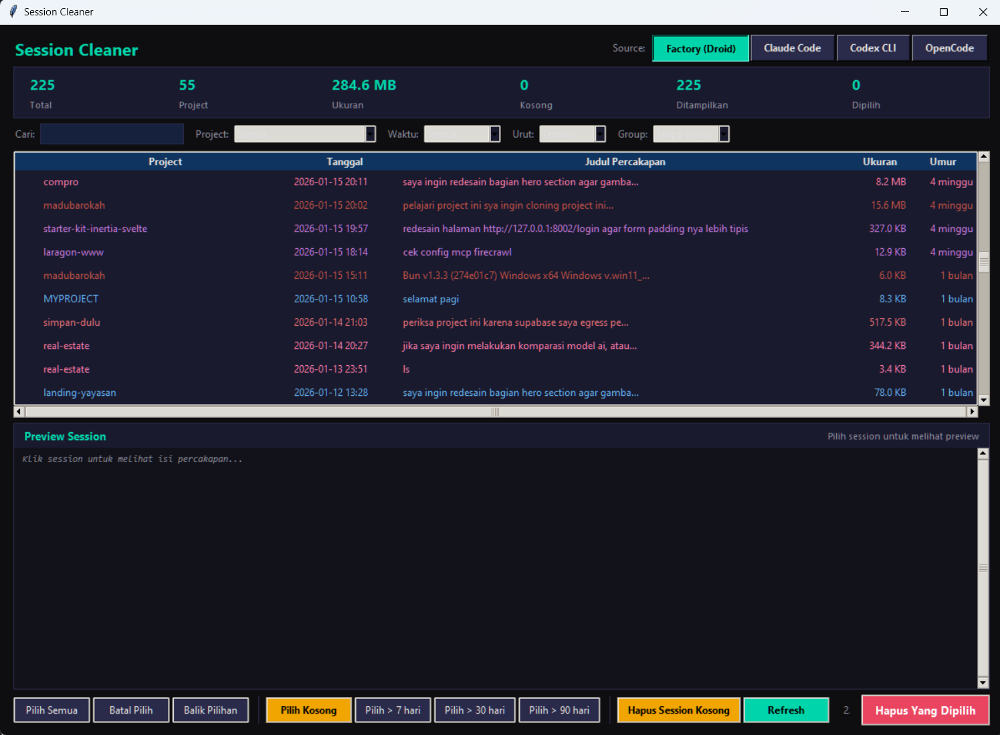

# AI CLI Session Manager

Desktop GUI app to browse, preview, resume, and manage chat session files from AI coding CLI tools.


## Why This Tool?

AI coding CLI tools (Factory/Droid, Claude Code, Codex CLI, OpenCode, etc.) store conversation sessions locally but **do not provide a unified way to manage them**. Over time, hundreds of session files accumulate on disk -- many of them blank or abandoned -- with no easy way to browse, preview, resume, or clean them up.

This tool was built to solve that problem: a single app that lets you manage sessions across **multiple AI CLI tools** in one place. Browse conversations, resume sessions directly, rename titles, and bulk-delete old files. Currently supports 4 sources, with more planned as new tools emerge.

## Screenshot



## Supported Tools

| Tool | Session Location | Format |
|---|---|---|
| **Factory (Droid)** | `~/.factory/sessions/` | JSONL |
| **Claude Code** | `~/.claude/projects/` | JSONL |
| **Codex CLI** | `~/.codex/sessions/` | JSONL |
| **OpenCode** | `~/.local/share/opencode/storage/` | JSON |

## Features

- **Switch between tools** with one click
- **Search** by title, project, or date
- **Filter** by project, time range
- **Sort** by date, name, size, project
- **Group by** project, date, month, or age
- **Preview** conversation content with pagination (20 per page, Load More button)
- **Open/Resume session** directly from the app (double-click, right-click, or button)
- **Cross-platform** terminal launch -- Windows (CMD), macOS (iTerm2/Terminal.app), Linux (gnome-terminal, konsole, etc.)
- **Rename session title** -- right-click > "Rename" (Factory, Claude Code, OpenCode)
- **Model column** -- shows which AI model was used per session
- **Right-click context menu** -- Open Session, Rename, Copy Session ID, Delete
- **Language toggle** -- Indonesian / English (ID/EN)
- **Color-coded** projects for quick visual identification
- **Detect empty/blank sessions** (no messages, "New Session" without conversation)
- **Bulk delete** -- select by age (>7/30/90 days), select all blank, or manual multi-select
- **Auto-cleanup** empty folders after deletion
- **Stats dashboard** -- total sessions, projects, disk usage, blank count

## Open / Resume Session

Open a session directly from the app into a terminal. The behavior depends on the tool:

| Tool | Action |
|---|---|
| **Claude Code** | Opens terminal and runs `claude --resume <session-id>` with optional `--dangerously-skip-permissions` via dialog checkbox |
| **Codex CLI** | Opens terminal and runs `codex resume <session-id>` -- resumes the conversation directly |
| **Factory (Droid)** | Opens terminal and runs `droid --resume <session-id>` -- resumes the conversation directly |
| **OpenCode** | Opens terminal and runs `opencode -s <session-id>` -- resumes the conversation directly |

**How to use:**
- **Double-click** a session in the list
- **Right-click** > "Open Session"
- **Select a session** and click the "Open Session" button

## Getting Started

### 1. Requirements

- Python 3.8 or later
- `tkinter` (included with Python on Windows and most Linux distros)

No third-party packages needed. All imports are from the Python standard library.

If `tkinter` is missing:
```bash
# Ubuntu/Debian
sudo apt install python3-tk

# Fedora
sudo dnf install python3-tkinter

# macOS (Homebrew)
brew install python-tk
```

### 2. Clone & Install

```bash
git clone https://github.com/RobithYusuf/ai-cli-session-manager.git
cd ai-cli-session-manager
```

### 3. Run

```bash
python app.pyw
```

Or on Windows, double-click `run.bat` or `app.pyw`.

**Optional:** Create a desktop shortcut (Windows):
```bat
@echo off
start "" pythonw "C:\path\to\ai-cli-session-manager\app.pyw"
```

## How It Works

The app reads session files directly from each tool's local storage directory. It does **not** connect to any API or send data anywhere. All operations are local file reads and deletes.

### What gets deleted

When you delete a session:

- **Factory**: `.jsonl` file + `.settings.json` if present
- **Claude Code**: `.jsonl` file + associated subfolder (file history snapshots)
- **Codex CLI**: `.jsonl` file + empty parent date folders
- **OpenCode**: session `.json` + message folder + part folders + session_diff file

## License

MIT
